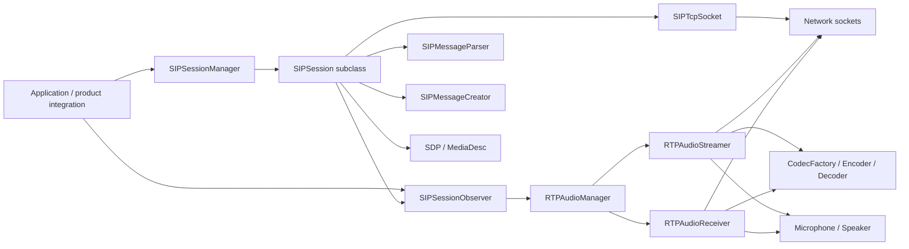
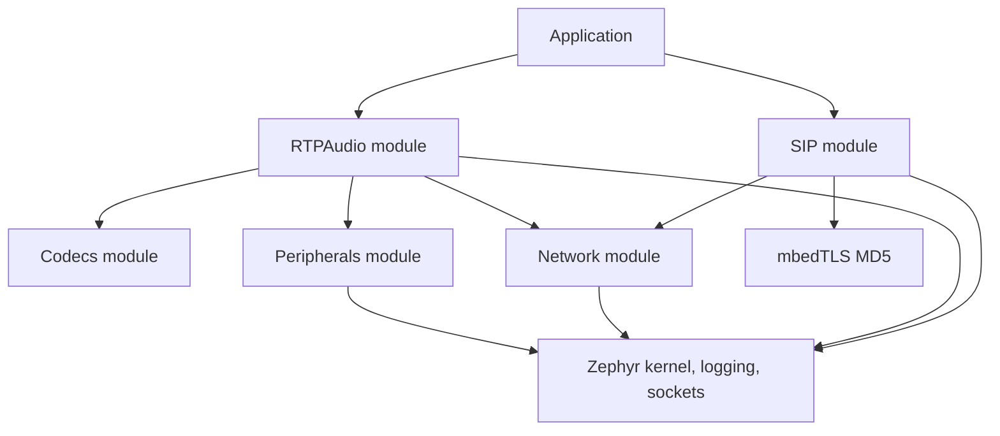
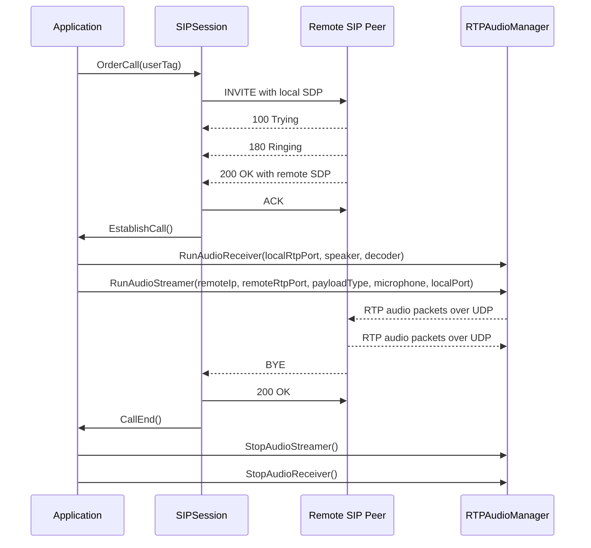

# VOIP Stack

This document describes the VOIP stack implemented in this SDK. The stack is split into two Zephyr modules:

- `modules/VOIP/SIP/zephyr`: SIP signaling, SDP negotiation, call session state, and call lifecycle callbacks.
- `modules/VOIP/RTPAudio/zephyr`: RTP packetization, UDP audio streaming, UDP audio receiving, codec selection, and audio device access.

The SIP layer does not directly own microphone or speaker devices. Instead, it exposes call lifecycle events through `SIPSessionObserver`. Product or application code is expected to implement that observer and start or stop the RTP audio paths when calls are established, ended, failed, or renegotiated.

## High-Level Architecture

## Build-Time Modules

### SIP Module

The SIP module is enabled by `CONFIG_ACTIA_SIP`. Its CMake file adds the SIP include directory, creates a Zephyr library, compiles the SIP source files, and links the `AutoMutex` library.

Important Kconfig symbols:

| Symbol | Purpose | Default |
| --- | --- | --- |
| `CONFIG_ACTIA_SIP` | Enables the ACTIA SIP library. | `n` |
| `CONFIG_ACTIA_SIP_MAXIMUM_SESSIONS_NUMBER` | Number of SIP session stacks allocated by `SIPSessionManager`. | `1` |
| `CONFIG_ACTIA_SIP_SEND_TRYING_AFTER_RECEIVED_INVITE` | Sends `100 Trying` immediately after an incoming `INVITE`. | `n` |
| `CONFIG_ACTIA_SIP_PICK_UP_CALL_TIMEOUT_S` | Timeout used while waiting for the remote side to answer an outgoing call. | `30` |
| `CONFIG_ACTIA_SIP_DOMAIN_NAME` | Uses `actia.com` in selected SIP `To` and `From` header generation paths. | `n` |

### RTP Audio Module

The RTP audio module is enabled by `CONFIG_ACTIA_RTP_AUDIO`. Its CMake file adds the RTP include directory, creates a Zephyr library, compiles RTP audio source files, and links `Peripherals` and `Network`.

Important Kconfig symbols:

| Symbol | Purpose | Default |
| --- | --- | --- |
| `CONFIG_ACTIA_RTP_AUDIO` | Enables the ACTIA RTP audio library. | `n` |
| `CONFIG_RTP_AUDIO_MUTEX_TIMEOUT_MS` | Mutex timeout for `RTPAudioManager`. | `1000` |
| `CONFIG_RTP_JOIN_MULTICAST` | Enables multicast join/leave for RTP receiving. | `n` |
| `CONFIG_RTP_MULTICAST_ADDRESS` | Multicast group used when multicast receiving is enabled. | `239.162.224.200` |
| `CONFIG_RTP_TX_PERIOD_MS` | Audio transmit packet period in milliseconds. | `20` |
| `CONFIG_RTP_TX_LOCAL_PORT` | Local UDP source port for RTP streaming, where `0` means any port. | `0` |
| `CONFIG_RTP_DEFAULT_RECEIVING_AUDIO_PORT` | Local RTP port advertised in generated SDP. | `12345` |

## Include And Dependency Map

The VOIP folder is not self-contained. It contains the SIP and RTPAudio code, but it depends on Zephyr, selected SDK modules, codec interfaces, and hardware audio abstractions.

### Module Build Metadata

Each VOIP submodule has a `module.yml` file that only declares Zephyr build metadata:

- `build.cmake: zephyr`.
- `build.kconfig: zephyr/Kconfig`.

The actual source selection and explicit library links are in each `CMakeLists.txt`:

| Module | Enabled by | Include directory exported | Source library links |
| --- | --- | --- | --- |
| SIP | `CONFIG_ACTIA_SIP` | `modules/VOIP/SIP/zephyr/src` | `AutoMutex` |
| RTPAudio | `CONFIG_ACTIA_RTP_AUDIO` | `modules/VOIP/RTPAudio/zephyr/src` | `Peripherals`, `Network` |

The SIP code also includes `Network.hpp` through `SIPTCPSocket.hpp`, so it has a source-level dependency on the SDK Network module even though the SIP CMake file currently only links `AutoMutex` explicitly.

### Internal SIP Includes

The SIP module has four internal groups:

| Group | Main headers | Used for |
| --- | --- | --- |
| Session core | `SIPSession.h`, `SIPSessionContext.h`, `SIPSessionState.h`, `SIPThreadContext.h`, `SIPSessionObserver.h` | State machine, call context, thread context, and application callbacks. |
| Session variants | `SIPRegistrableSession.h`, `SIPOutgoingDirectCallSession.h`, `SIPIncommingDirectCallSession.h`, `SIPSessionManager.h` | Concrete session modes and factory/lifetime management. |
| Message handling | `Message/SIPMessage.h`, `Message/SIPMessageCreator.h`, `Message/SIPMessageParser.h`, `SIPAllowRequests.h` | SIP request/response classification, parsing, and generation. |
| SDP and auth | `SDP/SDP.h`, `SDP/SDPMediaDesc.h`, `SDP/SDPAttribute.h`, `Authenticate/SIPAuthenticator.h` | SDP offer/answer handling and Digest authentication. |

The most important include relationships are:

- `SIPSession.h` includes the message creator/parser, SDP, session context, observer, state enum, TCP socket wrapper, and thread context.
- `SIPSessionContext.h` includes `SIPAuthenticator`, `SDP`, and `SIPAllowRequests`, because the context stores authentication state, local/remote SDP, and the `Allow` header list.
- `SIPSessionManager.cpp` includes all concrete session subclasses because it constructs them directly.
- `SIPMessageCreator.h` includes `SIPSessionContext.h`, because every generated SIP message is filled from session context fields.
- `SIPMessageParser.h` includes `SIPSessionContext.h` and `SIPMessage.h`, because parsing both classifies the message and updates selected session values such as CSeq.
- `SDP.h` includes SDP media and attribute headers.
- `SIPTCPSocket.hpp` includes `Network.hpp` and Zephyr POSIX socket headers.

### Internal RTPAudio Includes

The RTPAudio module has three internal groups:

| Group | Main headers | Used for |
| --- | --- | --- |
| RTP framing | `RTP.hpp`, `RTPClient.hpp`, `RTPServer.hpp` | RTP header layout, sender packet serialization, receiver packet parsing. |
| Media workers | `RTPAudioStreamer.hpp`, `RTPAudioReceiver.hpp`, `RTPAudioManager.hpp` | Threaded send/receive workers and lifecycle management. |
| SDK media interfaces | `CodecFactory.hpp`, `Microphone.hpp`, `Speaker.hpp` | Codec creation and hardware audio access. |

The most important include relationships are:

- `RTPAudioManager.hpp` includes `RTPAudioReceiver.hpp` and `RTPAudioStreamer.hpp`, because the manager owns one object of each type.
- `RTPAudioStreamer.hpp` includes `CodecFactory.hpp`, `Microphone.hpp`, `RTPClient.hpp`, and `Sockets/client_socket.hpp`.
- `RTPAudioReceiver.hpp` includes `CodecFactory.hpp`, `RTPServer.hpp`, `Sockets/server_socket.hpp`, and `Speaker.hpp`.
- `RTPAudioManager.cpp` includes `Sockets/igmp.hpp` for multicast join/leave support.
- `RTPAudioStreamer.cpp` includes `Network.hpp` for broadcast address lookup when codec debug transmission is enabled.
- `RTPClient.cpp` and `RTPServer.cpp` include Zephyr byte-order helpers for RTP sequence and timestamp fields.

### SDK Module Dependencies

| Dependency | Used by | Why it is needed |
| --- | --- | --- |
| `modules/System/Network/zephyr/src/Network.hpp` | `SIPTCPSocket`, `RTPAudioStreamer` | Local network information and broadcast address support. |
| `modules/System/Network/zephyr/src/Sockets/client_socket.hpp` | `RTPAudioStreamer` | UDP client socket base class for RTP transmission. |
| `modules/System/Network/zephyr/src/Sockets/server_socket.hpp` | `RTPAudioReceiver` | UDP server socket base class for RTP reception. |
| `modules/System/Network/zephyr/src/Sockets/igmp.hpp` | `RTPAudioManager` | Join and leave multicast RTP groups. |
| `modules/Peripherals/zephyr/src/Microphone/Microphone.hpp` | `RTPAudioStreamer` | Captures PCM samples before encoding and RTP transmission. |
| `modules/Peripherals/zephyr/src/Speaker/Speaker.hpp` | `RTPAudioReceiver` | Plays decoded PCM samples. |
| `modules/AudioProcessing/Codecs/zephyr/src/CodecFactory.hpp` | `RTPAudioStreamer`, `RTPAudioReceiver` | Creates encoders and decoders from RTP payload type. |
| `modules/Utils/AutoMutex` | SIP CMake link | Linked by the SIP module; likely used by shared synchronization utilities pulled in through the SIP build. |
| `includes/sdk_macros.h` | `RTPAudioReceiver` | Provides helper macros such as rate-limited logging helpers. |

### Zephyr And Third-Party Dependencies

| Dependency | Used by | Why it is needed |
| --- | --- | --- |
| Zephyr kernel APIs | SIP session manager, SIP thread context, RTP audio manager, media workers | Threads, stacks, mutexes, semaphores, sleeps, atomics, and task control. |
| Zephyr logging | SIP, SDP, RTPAudio, RTPClient, RTPServer | Module logging with `LOG_MODULE_REGISTER` and `LOG_*` macros. |
| Zephyr/POSIX sockets | `SIPTCPSocket`, `RTPAudioStreamer`, `RTPAudioReceiver` through socket wrappers | TCP SIP signaling and UDP RTP media transport. |
| Zephyr network IP helpers | `SIPTCPSocket` | Reads the default interface IPv4 address for local SIP/SDP data. |
| Zephyr byte-order helpers | `RTPClient`, `RTPServer` | Maintains RTP sequence and timestamp fields in network byte order. |
| mbedTLS MD5 | `SIPAuthenticator` | Computes Digest authentication hashes. |
| C and C++ standard library | Most VOIP files | Strings, vectors, maps, algorithms, parsing helpers, random values, and basic C functions. |

### Dependency Direction

The intended dependency direction is:

SIP and RTPAudio should stay independent at the module level. SIP should expose signaling state and SDP information; RTPAudio should expose media start/stop/hold operations. The application or a dedicated VOIP facade should connect those two modules.

### What This Means For A PJPROJECT Port

If PJPROJECT is introduced, this include/dependency map becomes one of the first things to redesign:

- If replacing only SIP, PJPROJECT should depend on Zephyr and Network, but should still publish enough SDP/call-state information for the existing RTPAudio module.
- If replacing SIP and RTPAudio, PJMEDIA needs adapters for `Microphone`, `Speaker`, and existing codec classes or the current media module becomes unused.
- If keeping both stacks, avoid exposing PJPROJECT headers directly through existing public VOIP headers unless the application is intentionally allowed to depend on PJPROJECT APIs.
- Keep third-party PJPROJECT includes behind a small SDK wrapper where possible. That keeps most application code independent from PJPROJECT version changes.
- Define Kconfig/CMake mutual exclusion clearly so one build does not accidentally enable both the current SIP/RTP implementation and a PJPROJECT backend that tries to own the same sockets or audio devices.

## SIP Signaling Layer

The SIP implementation centers on `SIPSession`. It owns the TCP connection, session context, SIP parser, message buffer, and call state. It is an abstract base class; concrete behavior is provided by specialized session types.

### Main Classes

| Class | Responsibility |
| --- | --- |
| `SIPSession` | Shared call-control state machine, TCP read/write handling, SIP request/response processing, SDP handling, and observer callbacks. |
| `SIPRegistrableSession` | Client-style session that connects to a SIP server and can register, idle, receive calls, make calls, and manage active calls. |
| `SIPOutgoingDirectCallSession` | Direct outgoing call mode. Its worker thread is suspended until a call is ordered, then connects and places the call. |
| `SIPIncommingDirectCallSession` | Direct incoming call mode. It listens on a local TCP port, accepts one incoming TCP connection, and handles an incoming `INVITE`. |
| `SIPSessionManager` | Factory and lifetime manager for sessions. Allocates Zephyr thread stacks, starts session threads, tracks active sessions, and deletes sessions. |
| `SIPSessionContext` | Mutable per-call data: local/remote user tags, URLs, ports, SIP identifiers, CSeq, authentication state, local SDP, remote SDP, and received Via headers. |
| `SIPMessageCreator` and subclasses | Build outbound SIP messages such as `REGISTER`, `INVITE`, `ACK`, `200 OK`, `180 Ringing`, `100 Trying`, authorization retry, and `BYE`. |
| `SIPMessageParser` | Parses incoming SIP headers and SDP body lines, classifies message type, and extracts tags, branch, Call-ID, CSeq, transport, URL, port, and authentication fields. |
| `SDP` and `MediaDesc` | Parse and generate SDP session/media descriptions. The generated local media description advertises RTP/AVP audio. |
| `SIPAuthenticator` | Implements SIP Digest authentication response generation using MD5. |

### Session Creation And Threading

Sessions are created only through `SIPSessionManager`:

- `CreateRegistrable(localUserTag, userPassword, remoteURL, remotePort, observer)` creates a `SIPRegistrableSession`.
- `CreateIncommingDirectCall(localUserTag, localTCPport, observer)` creates a `SIPIncommingDirectCallSession`.
- `CreateOutgoingDirectCall(localUserTag, remoteURL, remotePort, observer)` creates a `SIPOutgoingDirectCallSession`.

For each session, the manager:

1. Takes `SIPSessionMenageSemaphore`.
2. Lazily fills a pool of thread stack pointers from `SIPSessionStakArray`.
3. Allocates one stack to the session.
4. Starts a Zephyr thread with priority `12` and stack size `10240` bytes.
5. Stores the session in `mActiveSessions`.
6. Releases the semaphore.

The session thread entry point is `SIPSessionManager::Manage`, which simply calls the virtual `Task()` method on the session instance.

Deletion reverses this ownership: the manager returns the stack to the free pool, aborts the session thread, erases the session from `mActiveSessions`, and deletes the object.

### SIP Session State Model

The state enum contains:

- `unregister`: session should perform SIP registration.
- `registration`: registration request is in progress.
- `idle`: connected and not in a call.
- `calling`: outbound `INVITE` transaction is in progress.
- `inCall`: call is established and the session watches for `BYE`, re-`INVITE`, or local abort.
- `connecting`: socket connection setup or reconnect in progress.
- `makeCall`: a call has been requested and should be started by the session task.

The base class also uses atomic command flags:

- `mDoAbortCall`: request to terminate an established call.
- `mDoAcceptCall`: request to accept a pending incoming call.
- `mDoMakeCall`: request to place an outgoing call from an idle session.

These flags let API calls request work from the owning session thread without directly executing the full call transaction in the caller context.

## SIP Transport And Message Framing

SIP signaling uses `SIPTcpSocket`. The base `SIPSession` connects with `SocketConnect(remote_ip, remote_port)`, stores the local network address and port returned by the socket, and resets the receive buffer state.

Incoming SIP messages are read with `ReadMessage(timeout_s)`. It keeps a persistent buffer so multiple messages or partial messages can be handled across reads:

1. If a complete previous message is still at the front of the buffer, it is removed with `memmove`.
2. Data is read from the TCP socket into `mMsgBuffer`.
3. The parser waits until it sees `\r\n\r\n`, which marks the end of SIP headers.
4. It looks for `Content-Length:` case-insensitively.
5. It waits until the full header plus body length is present.
6. It terminates the current message and returns the complete length.

`HandleResponse()` wraps this read operation. On success, it logs the SIP message and passes the buffer to `SIPMessageParser::ParseMessage()`. A zero-length read is treated as timeout or EAGAIN and maps to `Unknown`; a negative read maps to `Error`.

## SIP Message Parsing

`SIPMessageParser` separates a received message into two structures:

- A SIP header map keyed by header names, with the first line stored as `Header`.
- A context vector containing the message body, normally SDP lines.

It classifies messages by the first line:

- Response lines beginning with `SIP/2.0` are converted from their numeric code to `SIPMessageType`.
- Request lines beginning with `INVITE`, `ACK`, or `BYE` are mapped to their enum values.
- Unsupported or malformed messages become `Unknown`.

The parser provides helpers for extracting:

- User tags from `From` or `To`.
- Remote URL and remote port.
- `rinstance` from `Contact`.
- `fromTag` and `toTag`.
- Transport protocol from the request line or `Via`.
- Branch ID, stripping the `z9hG4bK` prefix when present.
- `Call-ID`.
- `CSeq`.
- All received `Via` headers, used when creating responses to incoming requests.
- Digest authentication fields from `WWW-Authenticate`.

## SIP Message Generation

`SIPMessageCreator` provides common header construction helpers, while subclasses build complete messages. Generated messages include standard SIP fields such as:

- Request or status line.
- `Via`.
- `Max-Forwards`.
- `Contact`.
- `To` and `From`.
- `Call-ID`.
- `CSeq`.
- `User-Agent`.
- `Content-Type` and `Content-Length`.
- `Allow`.
- `Expires`.
- `Authorization` when Digest authentication is needed.

Supported generated messages are:

- `REGISTER`.
- `INVITE` with SDP payload.
- `ACK`.
- `200 OK` without SDP.
- `200 OK` with SDP.
- `180 Ringing`.
- `100 Trying`.
- Digest authorization retry for registration.
- `BYE`.

`SIPTemporarilyUnavailable_480` exists as a class but currently returns `false`, so it is not implemented as a usable response generator.

## SDP Handling

The SIP stack uses SDP to describe audio media. Local SDP is generated by `SIPSession::FillLocalSDP()` after a successful socket connection:

1. `o=` is filled from the local user tag and local IP address.
2. `s=` is set to the local user tag.
3. `c=` is set to `IN IP4 <local address>`.
4. A media description is created for audio using `RTP/AVP`.
5. The default advertised media format is G.722 payload type `9`.
6. The local direction attribute is initially `sendrecv`.

`MediaDesc` uses `CONFIG_RTP_DEFAULT_RECEIVING_AUDIO_PORT` as the advertised RTP port and sets RTCP to RTP port plus one. The code contains a note that RTCP is not otherwise supported.

SDP parsing supports common SDP fields and one media description. When parsing connection data, the stack extracts the IP address from `c=IN IP4 ...` and stores it as the SDP URI. The media parser recognizes payload types:

- `0`: PCMU / G.711 u-law at 8000 Hz.
- `8`: PCMA / G.711 A-law at 8000 Hz.
- `9`: G.722 at 8000 Hz.
- `11`: L16 PCM at 8000 Hz.

Direction negotiation is handled for:

- `sendrecv`.
- `sendonly`.
- `recvonly`.
- `inactive`.

When replying to an incoming `INVITE` or re-`INVITE`, the stack mirrors direction appropriately:

- Remote `sendrecv` -> local `sendrecv`.
- Remote `sendonly` -> local `recvonly`.
- Remote `recvonly` -> local `sendonly`.
- Remote `inactive` -> local `inactive`.

## Outgoing Call Flow

An outgoing call is started when application code calls `OrderCall()` or `OrderMakeCall()`.

The base outgoing transaction is:

1. The session must be in `makeCall` state.
2. `Call()` changes state to `calling`.
3. A new `Call-ID` is generated.
4. The remote user tag is stored in the session context.
5. The session sends an `INVITE` containing local SDP.
6. It waits for SIP responses over TCP.
7. If it receives `401 Unauthorized`, it parses `WWW-Authenticate`, generates a Digest response, sends an authenticated registration-style retry, and waits for `200 OK`.
8. If it receives `100 Trying`, it waits again.
9. If it receives `180 Ringing`, it waits up to `CONFIG_ACTIA_SIP_PICK_UP_CALL_TIMEOUT_S` for the final response.
10. If it receives `200 OK`, it extracts the remote `To` tag, parses remote SDP, sends `ACK`, and marks the call established.
11. If it receives `486 Busy Here`, `480 Temporarily Unavailable`, an error, or an unsupported message, the call fails and returns to `idle`.

When the call becomes established, `SIPSession::CallEstablished()` changes the state to `inCall` and calls `SIPSessionObserver::EstablishCall()`. If the observer cannot establish media, the SIP session aborts the call.

## Incoming Call Flow

Incoming call handling depends on the selected session type.

### Registrable Session

`SIPRegistrableSession` connects to a remote SIP server, fills local SDP, and then loops while connected. In `idle`, it reads SIP traffic with a one-second timeout. If it receives an `INVITE`:

1. Remote SDP is parsed.
2. Remote identity, tags, transport, branch, Call-ID, CSeq, and Via headers are extracted.
3. If enabled, `100 Trying` is sent.
4. `180 Ringing` is sent.
5. `SIPSessionObserver::PendingIncomingCall(remoteUserTag)` is called.
6. The parsed invite is saved for later acceptance.

Acceptance is explicit. When `OrderAcceptCall()` is called, `HandleIdleState()` consumes `mDoAcceptCall` and calls `AcceptIncommingInvite()`:

1. `mIsIncommingInvite` is set.
2. A `200 OK` response with SDP is sent.
3. The session waits for `ACK`.
4. On `ACK`, the call is established and `SIPSessionObserver::EstablishCall()` is called.

### Incoming Direct Call Session

`SIPIncommingDirectCallSession` acts as a simple TCP server:

1. It listens on the configured local TCP port.
2. It waits for an incoming TCP connection.
3. It stores local socket address data and fills local SDP.
4. It asks the observer whether an incoming call should be accepted.
5. It resets the SIP receive buffer and handles the incoming `INVITE`.
6. While connected and in call, it runs the in-call state handler.
7. When the call ends or the socket closes, it disconnects and returns to `connecting`.

This mode does not support placing calls; `OrderCall()` always returns false.

### Outgoing Direct Call Session

`SIPOutgoingDirectCallSession` is optimized for direct outbound calls:

1. Its task normally suspends itself.
2. `OrderCall()` stores the remote user tag, sets state to `makeCall`, and resumes the thread.
3. The task reconnects to the configured peer.
4. On connect, it starts the outgoing call flow.
5. While in call, it runs the in-call state handler.
6. When the state leaves `makeCall` or `inCall`, the socket is disconnected and the task suspends again.

The direct outgoing implementation resets `cSequence` to zero before `HandleMakeCall()` because the invite creator increments CSeq before building the request.

## Established Call Handling

While in `inCall`, the SIP session calls `HandleInCallState()` repeatedly. This function reads with a one-second timeout so local abort requests can be processed even when no SIP packets arrive.

The in-call handler supports:

- Remote `BYE`: updates the branch from the received message, sends `200 OK`, changes state to `idle`, and calls `SIPSessionObserver::CallEnd()`.
- Remote re-`INVITE`: parses new remote SDP, updates dialog fields, sends `200 OK` with adjusted local SDP direction, calls `SIPSessionObserver::ReInvite()`, and waits for `ACK`.
- Local abort request: sends `BYE` up to three times, waits briefly for `200 OK`, then always transitions to `idle` and calls `CallEnd()`.

For incoming calls, `AbortCall()` swaps `toTag` and `fromTag` before building `BYE`, because the local endpoint generated the `toTag` during the incoming transaction but the outgoing BYE must place the local tag in the `From` side of the new request.

## RTP Audio Layer

The RTP audio layer is independent from SIP. It exposes static methods on `RTPAudioManager` to start, stop, and hold the send and receive audio streams.

### RTPAudioManager

`RTPAudioManager` owns at most one active streamer and one active receiver:

- `mAudioStreamer`: active microphone-to-network RTP sender.
- `mAudioReceiver`: active network-to-speaker RTP receiver.

Access is protected by `RTPAudioMutex`, using `CONFIG_RTP_AUDIO_MUTEX_TIMEOUT_MS`.

The manager creates one Zephyr thread for each media direction:

- Streamer task name: `RTP audio streamer`.
- Streamer stack size: `KB(30)`.
- Streamer priority: `5`.
- Receiver task name: `RTP audio receiver`.
- Receiver stack size: `KB(30)`.
- Receiver priority: `5`.

When multicast is enabled, starting the receiver joins `CONFIG_RTP_MULTICAST_ADDRESS`; stopping the receiver leaves that multicast group.

### RTPAudioStreamer

`RTPAudioStreamer` sends encoded microphone audio over UDP. It derives from `client_socket`, configured with:

- Remote RTP IP address.
- Remote RTP port.
- `IPPROTO_UDP`.
- RX buffer size `1500`.
- TX buffer size `1500`.
- Local UDP port supplied by the caller.

The streamer is constructed with a payload type, microphone pointer, remote endpoint, local port, and initial hold state. Construction creates an encoder through `CodecFactory::CreateEncoder(payloadType)`, sets hold state, and starts microphone recording.

Every send iteration:

1. Reads `TX_SAMPLES_SIZE` samples from the microphone. `TX_SAMPLES_SIZE` is calculated as `CONFIG_RTP_TX_PERIOD_MS * CONFIG_ACTIA_CODEC_SAMPLING_FREQUENCY / 1000`.
2. Asks the encoder for the expected encoded size.
3. Verifies that the encoded payload fits in the RTP payload capacity of `1300` bytes.
4. Encodes raw samples into the RTP frame payload.
5. Updates the RTP payload size.
6. If not on hold, serializes and sends the RTP frame, then increments sequence number and timestamp.
7. If on hold, does not send the frame, but still advances the timestamp and marks the next sent packet as a fresh start.

When `CONFIG_ACTIA_CODEC_DEBUG_TXIN` is enabled, the streamer also creates a second RTP client and a raw debug UDP socket that sends debug data to broadcast port `6666`.

On destruction, the streamer stops microphone recording, closes the optional debug socket, deletes encoders, and logs the number of sent packets.

### RTPAudioReceiver

`RTPAudioReceiver` receives RTP packets over UDP and plays decoded audio to a speaker. It derives from `server_socket`, configured with:

- Local UDP port.
- `IPPROTO_UDP`.
- RX buffer size `1500`.
- TX buffer size `1500`.

The receiver is constructed with a local port, speaker pointer, optional decoder pointer, and initial hold state. It starts the speaker during construction.

Every receive iteration:

1. Reads a UDP datagram from the socket.
2. Reinterprets the datagram as an RTP frame if it is at least as large as an RTP header.
3. Logs basic RTP header fields.
4. Warns if padding, extension, or contributor count are set, because the code assumes a fixed 12-byte RTP header.
5. If no decoder was supplied, autodetects the payload type from the RTP header and creates a decoder through `CodecFactory::CreateDecoder(payloadType)`.
6. Drops packets whose payload type does not match the active decoder.
7. If not on hold, computes the decoded sample count, decodes the RTP payload to raw audio samples, and sends them to `Speaker::PlayRecord()`.
8. Increments the packet counter and logs every 100 packets.

When hold is cleared after previously being enabled, the receiver flushes the speaker before resuming playback.

On destruction, the receiver stops the speaker, deletes the decoder if present, and logs the number of received packets.

## RTP Packet Format

The RTP implementation uses a compact `RTPHeader` structure and a fixed payload buffer:

- RTP version: `2`.
- Maximum payload length: `1300` bytes.
- Padding: disabled.
- Extension: disabled.
- CSRC contributor count: `0`.
- First packet marker: `1`.
- Later packet marker: `0`.

Supported payload type constants:

| Payload type | Codec |
| --- | --- |
| `0` | G.711 u-law |
| `8` | G.711 A-law |
| `9` | G.722 |
| `11` | PCM / L16 |
| `96` | Opus |

`RTPClient` initializes timestamp, sequence number, and SSRC from `rand()`. Header sequence and timestamp fields are maintained in network byte order using Zephyr byte-order helpers.

Timestamp increments depend on payload type:

- G.722 increments by half the PCM sample count.
- G.711 A-law, G.711 u-law, and PCM increment by the sample count.
- Opus increments using a 48 kHz RTP clock: `48000 * CONFIG_RTP_TX_PERIOD_MS / 1000`.
- Unknown payloads fall back to the sample count and log a warning.

## SIP-to-RTP Integration Contract

The SIP stack expects application code to bridge signaling and media through `SIPSessionObserver`:

| Observer callback | When SIP calls it | Expected application behavior |
| --- | --- | --- |
| `PendingIncomingCall(std::string& userTag)` | An incoming `INVITE` has been parsed and `180 Ringing` was sent. | Decide whether to present, accept, or reject the pending call. Store UI/call state as needed. |
| `EstablishCall()` | SIP dialog has completed successfully. | Read local and remote SDP, start RTP receiver and/or streamer according to media direction and ports. Return `false` if media cannot start. |
| `CallEnd()` | A remote `BYE` was acknowledged or local abort completed. | Stop RTP streamer and receiver and clear call state. |
| `SessionFail()` | A registrable session detects lost SIP TCP connection. | Stop dependent media and report/recover the SIP session. |
| `ReInvite()` | A re-`INVITE` was accepted. | Re-read SDP direction/ports and update hold, stream direction, or media endpoints. |

A typical `EstablishCall()` implementation uses:

- `session->GetLocalSDP().getRtpAudioPort()` for the local receive port.
- `session->GetRemoteSDP().getRtpAudioPort()` for the remote RTP destination port.
- `session->GetRemoteSDP().getUri()` or the SIP remote address for the remote RTP destination IP address.
- `RTPAudioManager::RunAudioReceiver(...)` for inbound audio.
- `RTPAudioManager::RunAudioStreamer(...)` for outbound audio.
- `SDP::FindDirectionAttribute()` to decide whether to start both directions, only transmit, only receive, or neither.

## Typical Bidirectional Call Sequence

## Hold And Re-INVITE Behavior

The stack has hold support at both signaling and media levels:

- SDP direction attributes are parsed and rewritten during `200 OK` generation for incoming `INVITE` and re-`INVITE` handling.
- `RTPAudioManager::HoldAudioStreamer(bool)` marks the streamer as held or active.
- `RTPAudioManager::HoldAudioReceiver(bool)` marks the receiver as held or active.
- While streamer hold is active, RTP packets are not sent, sequence numbers do not advance, timestamps still advance, and the marker bit is set so the next transmitted packet starts cleanly.
- While receiver hold is active, RTP packets can still be received and parsed, but decoded audio is not played.
- When receiver hold is released, `Speaker::Flush()` is called before playback resumes.

The `ReInvite()` observer callback is the main hook where application code should align RTP hold state with updated remote SDP direction.

## Registration And Authentication

`SIPRegistrableSession` has a registration state path, although its current `Reconnect()` implementation sets the state to `idle` after connecting and includes a comment that registration is not needed for the SIP server path in use.

When registration is performed, `HandleRegisterState()` sends `REGISTER` and accepts:

- `200 OK`: registration succeeded and the session becomes `idle`.
- `401 Unauthorized`: parses `WWW-Authenticate`, generates a Digest MD5 response, sends the authenticated request, and expects `200 OK`.

Only SIP Digest with MD5 is implemented.

## Resource Ownership

### SIP

- `SIPSessionManager` owns created sessions.
- Each session owns its `SIPTcpSocket`, session context, message parser, receive buffer, and Zephyr thread context.
- Session lifetime is manual: `DeleteSession()` must be used to release the thread stack, abort the thread, remove the session from the active list, and delete the object.

### RTP

- `RTPAudioManager` owns one `RTPAudioStreamer` and one `RTPAudioReceiver` at a time.
- `RunAudioStreamer()` and `RunAudioReceiver()` reject creation if that direction is already active.
- `StopAudioStreamer()` and `StopAudioReceiver()` delete the active object and clear the static pointer.
- Microphone and speaker objects are passed in by pointer and are not owned by RTPAudio.
- The streamer owns its encoder.
- The receiver owns its decoder pointer, including a decoder it autodetects and creates internally.

## Error Handling And Limitations Visible In Code

The current implementation is functional but intentionally narrow in several places:

- SIP signaling is TCP-based in this stack; RTP media is UDP-based.
- The RTP receiver assumes no RTP padding, no RTP extensions, and no CSRC entries.
- RTCP port is advertised as RTP port plus one, but RTCP handling is marked as unsupported.
- Local SDP generation hardcodes default offer media to G.722 payload type `9` with `sendrecv` direction.
- Only one SDP media description is represented by `SDP::mMediaList`.
- `SIPTemporarilyUnavailable_480::CreateMessage()` is present but not implemented.
- Digest authentication supports MD5 only.
- Random SIP identifiers and RTP identifiers are generated using `rand()` and repeated `srand(time(0))` calls in the SIP context helper methods.
- Several comments and names use the spelling `Incomming`; the public names currently follow that spelling.
- The observer implementation is outside this module, so this module describes when media should be started or stopped but does not itself select actual microphone, speaker, or codec objects.

## PJPROJECT Porting Considerations

PJPROJECT is not only a SIP message parser. It is a full communications stack made of PJLIB, PJLIB-UTIL, PJSIP, PJMEDIA, and optionally PJNATH. Before porting it into this SDK, the design document should describe whether PJPROJECT will replace the existing stack, wrap only part of it, or coexist beside it.

The current in-house stack has a small and explicit shape: SIP over TCP for signaling, SDP for one audio media description, and a separate RTPAudio module for UDP media. PJPROJECT can cover much more of that surface, including SIP transactions/dialogs, transport management, SDP, RTP/RTCP, jitter buffering, conference bridge, codec framework, sound device abstraction, NAT traversal, and TLS/SRTP depending on configuration. That larger scope is useful, but it also means the integration boundary must be documented carefully.

### First Decision: Replacement Strategy

Document one of these strategies before implementation starts:

| Strategy | Meaning | Main impact |
| --- | --- | --- |
| Replace SIP only | Use PJSIP for registration, dialogs, transactions, message parsing, and SDP, while keeping `RTPAudioManager` for media. | Requires mapping PJPROJECT call events and SDP data into the existing observer/RTPAudio contract. Lower media risk, but SIP and SDP ownership move to PJSIP. |
| Replace SIP and RTP | Use PJSIP plus PJMEDIA for signaling, RTP, codec handling, jitter buffering, and media ports. | Larger port, but removes more custom RTP/audio logic. Requires a PJMEDIA sound device backend for the existing microphone and speaker classes. |
| Coexist for selected calls | Keep the existing VOIP stack for current products and add PJPROJECT as a second backend. | Requires a common application-facing VOIP interface and careful resource arbitration for sockets, audio devices, ports, and threads. |
| Use PJPROJECT as reference only | Keep the current stack and selectively improve SIP/SDP/RTP behavior based on PJPROJECT behavior. | Lowest integration risk, but does not gain PJPROJECT protocol coverage directly. |

The recommended design direction must say which option is intended and which current classes remain public. Without that decision, the port can easily duplicate SIP state machines, duplicate RTP sockets, or create two independent owners of the same audio devices.

### PJPROJECT Components To Map

| PJPROJECT component | Role | Current equivalent or integration point |
| --- | --- | --- |
| PJLIB | OS abstraction, memory pools, threads, mutexes, timers, logging, socket wrappers. | Zephyr kernel APIs, `k_thread`, `k_mutex`, `k_sem`, Zephyr sockets, Zephyr logging. |
| PJLIB-UTIL | DNS, resolver, scanner/parsing utilities, STUN helpers. | Current code mostly avoids this; DNS/NAT requirements need definition. |
| PJSIP | SIP endpoint, transports, transactions, dialogs, registration, authentication, invite sessions. | `SIPSession`, `SIPSessionManager`, `SIPTCPSocket`, `SIPMessageCreator`, `SIPMessageParser`, `SIPAuthenticator`. |
| PJMEDIA | SDP, RTP/RTCP sessions, jitter buffer, codec framework, media ports, sound device abstraction. | `SDP`, `MediaDesc`, `RTPClient`, `RTPServer`, `RTPAudioStreamer`, `RTPAudioReceiver`, `CodecFactory`, `Microphone`, `Speaker`. |
| PJNATH | ICE, STUN, TURN, NAT traversal. | No current equivalent in the VOIP modules. |

### Zephyr Porting Layer

PJPROJECT needs an operating-system abstraction. The porting document should describe how PJLIB primitives map to Zephyr:

- Thread creation, priority, stack allocation, and thread naming.
- Mutexes, semaphores, events, and atomic operations.
- Timers and time source resolution.
- Sleep and delay behavior.
- Socket API compatibility for TCP and UDP.
- Nonblocking socket behavior and polling/select support.
- Memory allocation policy, including whether PJ pools use heap, static memory, or a custom allocator.
- Logging bridge from PJ logging levels to Zephyr logging modules.
- Assertion and error handling policy.
- Endianness and alignment assumptions on i.MX RT targets.

The current SIP session threads use fixed Zephyr stacks and priorities. PJPROJECT also creates worker threads and uses internal timers, so the design needs a thread model that prevents excessive stack use and priority inversion.

### Memory And Footprint Budget

The existing implementation uses a small number of fixed buffers and static thread stacks. PJPROJECT can be significantly larger. The document should include a measured or estimated budget for:

- Flash size increase for each enabled PJPROJECT library.
- RAM used by PJ memory pools.
- Thread stack sizes for SIP worker threads, media threads, timer processing, and sound device callbacks.
- Socket buffers for TCP SIP, UDP RTP, UDP RTCP, DNS, STUN, or TURN if enabled.
- Codec working memory.
- Jitter buffer memory if PJMEDIA is used.
- Maximum simultaneous calls or sessions.

This budget should be expressed for the target board configuration, not only for desktop PJPROJECT defaults.

### Network Behavior To Specify

The current signaling stack primarily uses SIP over TCP and RTP over UDP. A PJPROJECT port should explicitly define:

- Supported SIP transports: TCP only, UDP, TLS, or multiple transports.
- Local and remote SIP port selection.
- Whether DNS SRV/NAPTR lookup is needed or static IP/port configuration is enough.
- Keepalive behavior for long-lived TCP connections.
- Reconnect policy after link loss.
- IPv4-only or IPv6 support.
- Multicast RTP support and whether it remains implemented through existing `join_to_multicast()` and `leave_from_multicast()` helpers.
- RTCP support, because the current stack advertises an RTCP port but does not implement RTCP handling.
- NAT traversal requirements: none, STUN, TURN, or ICE.

If PJNATH is included, the document must also describe credential storage, server configuration, failure modes, and timing constraints.

### SIP Feature Scope

The current SIP stack handles a narrow set of messages. PJPROJECT supports a wider SIP feature set, so the desired product behavior should be written down:

- Registration required or optional.
- Direct peer-to-peer calling support.
- Incoming call policy and delayed accept behavior.
- Outgoing call retry and timeout behavior.
- Authentication mechanisms, currently only Digest MD5.
- Re-INVITE behavior for hold/resume and media updates.
- CANCEL support.
- OPTIONS keepalive or capability query support.
- Redirect responses such as `3xx`.
- Error responses such as `403`, `404`, `408`, `481`, `488`, and `5xx`.
- Multiple simultaneous sessions or single-call-only behavior.
- Mapping from SIP result codes to application errors.

The existing `SIPSessionObserver` callbacks are a good starting point, but they are probably not enough if PJPROJECT exposes registration state, transport state, call media state, provisional responses, redirects, and detailed failure causes.

### SDP And Codec Negotiation

The current local SDP advertises one audio media description, defaulting to G.722 payload type `9`, with simple direction handling. A PJPROJECT port should define:

- Exact codec list and priority order.
- Whether G.711 A-law, G.711 u-law, G.722, PCM/L16, and Opus are required.
- Static payload types versus dynamic payload types.
- Sample rate, channel count, frame time, and packetization time for each codec.
- How `CONFIG_RTP_TX_PERIOD_MS` maps to PJMEDIA frame timing.
- Whether PJMEDIA owns encoding/decoding or continues to call existing `CodecFactory` encoders and decoders.
- How unsupported remote codecs are rejected.
- Whether multiple media descriptions must be parsed or still only one audio stream is supported.
- How SDP connection address is selected when SIP signaling and media addresses differ.
- Hold/resume policy for `sendrecv`, `sendonly`, `recvonly`, and `inactive`.

If existing ACTIA codec implementations must remain, the design should describe a PJMEDIA codec adapter layer rather than replacing codecs silently.

### Audio Device Integration

If PJMEDIA is used for media, the biggest integration point is the audio device backend. The current RTPAudio code talks directly to:

- `Peripherals::Microphone::StartRecording()`.
- `Peripherals::Microphone::GetRecord()`.
- `Peripherals::Microphone::StopRecording()`.
- `Peripherals::Speaker::Start()`.
- `Peripherals::Speaker::PlayRecord()`.
- `Peripherals::Speaker::Flush()`.
- `Peripherals::Speaker::Stop()`.

The PJPROJECT design must decide whether:

- PJMEDIA pulls audio from these existing classes through a custom sound-device implementation.
- Existing RTPAudio continues to own devices and PJPROJECT only supplies signaling.
- A new adapter exposes microphone and speaker as PJMEDIA ports.

This section should include exact buffer sizes, sample format, sample rate, mono/stereo behavior, blocking behavior, and callback timing requirements. It should also document who owns start/stop sequencing so SIP call teardown cannot delete an object while a media callback still uses it.

### RTP, RTCP, And Jitter Buffering

The current RTP implementation has minimal fixed-header parsing and no jitter buffer. PJMEDIA can provide richer media transport behavior. The port design should state:

- Whether PJMEDIA RTP replaces `RTPClient` and `RTPServer`.
- Whether RTCP sender reports, receiver reports, and BYE packets are required.
- Jitter buffer target latency and maximum latency.
- Packet loss concealment behavior.
- Sequence-number gap handling.
- Timestamp drift handling.
- Clock synchronization assumptions between microphone, speaker, and RTP timestamps.
- Whether multicast RTP is still supported.
- Whether SRTP is required.

This is important because PJMEDIA may change real-time behavior even if SIP signaling remains compatible.

### Public API Compatibility

The port should define the API that application code will use after the change. A conservative migration can preserve the existing session manager and observer API and implement a PJPROJECT-backed session behind it.

Questions to answer:

- Does `SIPSessionManager::CreateRegistrable()` still exist?
- Do direct incoming and direct outgoing call session constructors still exist?
- Does `SIPSessionObserver` stay unchanged, or are richer callbacks added?
- How does application code obtain local and remote SDP after PJPROJECT owns the call?
- What replaces `OrderCall()`, `OrderAcceptCall()`, and `OrderAbortCall()`?
- Are `GetSessionsInfo()` and `GetSessionsSequences()` still supported?
- How are PJPROJECT call IDs mapped to current session objects?

### Configuration Model

PJPROJECT has its own compile-time feature macros. The SDK should hide those behind Zephyr Kconfig symbols where possible. The porting document should list:

- New Kconfig symbols to enable PJPROJECT globally.
- Per-feature options for SIP transport, registration, TLS, SRTP, ICE, codecs, RTCP, logging, and tests.
- Default values for the target product.
- Mutual exclusion rules between the existing SIP/RTP modules and PJPROJECT-backed modules.
- Required CMake integration and source/library layout.
- How third-party PJPROJECT source is fetched, patched, and version-pinned.

### Security Requirements

The current stack supports SIP Digest MD5. A PJPROJECT port is a good opportunity to document whether stronger security is required:

- SIP over TCP only, SIP over TLS, or both.
- Certificate storage and validation policy for TLS.
- Digest algorithms required by target servers.
- SRTP requirement for media encryption.
- Secure storage for SIP credentials.
- Logging policy for SIP messages so credentials and authorization headers are not leaked.
- Firmware update and licensing impact of adding PJPROJECT as a third-party dependency.

### Migration And Test Plan

The porting document should include an incremental migration plan:

1. Build PJLIB on Zephyr with a minimal sample.
2. Add socket, timer, mutex, thread, and logging adapters.
3. Build PJSIP without media and verify basic SIP message exchange.
4. Implement registration and authentication against the target SIP server.
5. Implement outgoing call with SDP offer/answer.
6. Implement incoming call with delayed accept behavior.
7. Decide whether existing RTPAudio or PJMEDIA owns media.
8. Add media send/receive and verify codec compatibility.
9. Add hold/resume through re-INVITE.
10. Add teardown, reconnect, and network-loss tests.
11. Measure CPU, stack, heap, packet loss, latency, and audio quality on target hardware.

Minimum test coverage should include:

- Outgoing successful call.
- Incoming successful call.
- Caller cancels before answer.
- Callee rejects or is busy.
- Remote sends BYE.
- Local abort sends BYE and handles missing `200 OK`.
- Re-INVITE hold and resume.
- Wrong codec offer.
- Lost SIP TCP connection.
- RTP packet loss, reordering, and timestamp discontinuity.
- Long call soak test.

### Open Design Questions

Before starting the port, answer these questions in the design document:

- Is the goal standards compliance, interoperability with more SIP servers, better media quality, NAT traversal, TLS/SRTP, or reduced maintenance of custom SIP code?
- Which PJPROJECT version will be used and how will it be pinned?
- Is dynamic allocation acceptable on the target firmware, or must PJ memory pools use fixed static regions?
- What is the maximum allowed flash and RAM growth?
- Are pthread-like APIs available or must all OS primitives be native Zephyr wrappers?
- Will the existing microphone/speaker/codec classes remain the hardware abstraction boundary?
- Does the product need RTCP, SRTP, ICE, TURN, or only basic SIP plus RTP?
- Must the existing public C++ API remain source-compatible for applications?
- How will PJPROJECT logs be filtered to avoid exposing credentials?
- What interoperability target will define success: a specific ACTIA SIP server, generic PBX, softphone, or test harness?

## Key Source Files

| Area | Files |
| --- | --- |
| SIP manager and sessions | `modules/VOIP/SIP/zephyr/src/SIPSessionManager.*`, `SIPSession.*`, `SIPRegistrableSession.*`, `SIPOutgoingDirectCallSession.*`, `SIPIncommingDirectCallSession.*` |
| SIP message creation/parsing | `modules/VOIP/SIP/zephyr/src/Message/SIPMessageCreator.*`, `SIPMessageParser.*`, `SIPMessage.h` |
| SDP | `modules/VOIP/SIP/zephyr/src/SDP/SDP.*`, `SDPMediaDesc.*`, `SDPAttribute.*` |
| Authentication | `modules/VOIP/SIP/zephyr/src/Authenticate/SIPAuthenticator.*` |
| RTP manager and media paths | `modules/VOIP/RTPAudio/zephyr/src/RTPAudioManager.*`, `RTPAudioStreamer.*`, `RTPAudioReceiver.*` |
| RTP frame handling | `modules/VOIP/RTPAudio/zephyr/src/RTP.*`, `RTPClient.*`, `RTPServer.*` |
| Build configuration | `modules/VOIP/SIP/zephyr/Kconfig`, `modules/VOIP/SIP/zephyr/CMakeLists.txt`, `modules/VOIP/RTPAudio/zephyr/Kconfig`, `modules/VOIP/RTPAudio/zephyr/CMakeLists.txt` |
